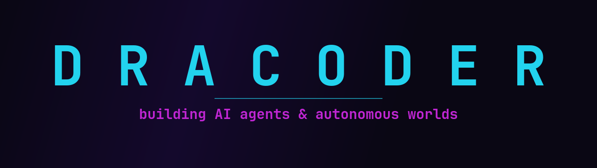

<div align="center">



<a href="https://github.com/dracoder">
  
</a>

<br/>


</div>

```txt
> boot dracoder ─────────────────────────────────────────────
  role      fullstack engineer · ai agents · automation
  stack     TypeScript · Node · Laravel · Vue · React · Next
  minds     any model, or local via Ollama
  building  Autopolis  ▓▓▓▓▓▓▓░░░  a city that runs itself
> _
```

### ◤ stack

<div align="center">


</div>

### ◤ contribution activity

<div align="center">


</div>

### ◤ featured build

> **▹ AUTOPOLIS**
> A deterministic simulation of a cyberpunk city run by 50 autonomous AI agents. They wake, commute, work, study, graduate, and get hired, all replayed byte for byte and rendered into cinematic reels. Drive the citizens with a local model.
>
> `TypeScript` · `Canvas 2D` · `SHA-256 deterministic replay` · `local-model minds`

<div align="center">
<sub>◦ dark cyber signal system ◦</sub>
</div>
