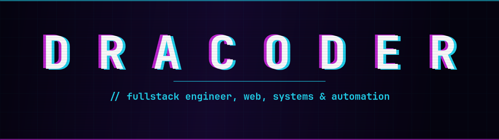

<div align="center">



<a href="https://github.com/dracoder">
  
</a>

<br/>


<br/>

<sub><code>// status: shipping the weird idea, not the deck about it</code></sub>

</div>

```txt
> boot dracoder ─────────────────────────────────────────────
  role      fullstack engineer · ai agents · automation
  stack     TS · JS · Python · PHP · C# · React · Next · Vue
            Laravel · Node · Inertia · Tailwind
  models    Claude · GPT-5 · Gemini · DeepSeek · Llama
  building  [ CLASSIFIED ]  ▓▓▓▓▓▓▓░░░
> _
```

### ◤ stack

<div align="center">

**ai & agents**


**languages**


**frameworks**


**data & infra**


</div>

### ◤ signal log

<div align="center">


</div>

### ◤ what i build

> **▹ signal to product**
> Creative apps and AI agents, plus the real-time systems and backends behind them. First prototype to production.
>
> `TypeScript` · `ai agents` · `automation` · `real-time systems`

### ◤ connect

<div align="center">


</div>

<div align="center">
<sub>◦ signal out · dracoder ◦</sub>
</div>
